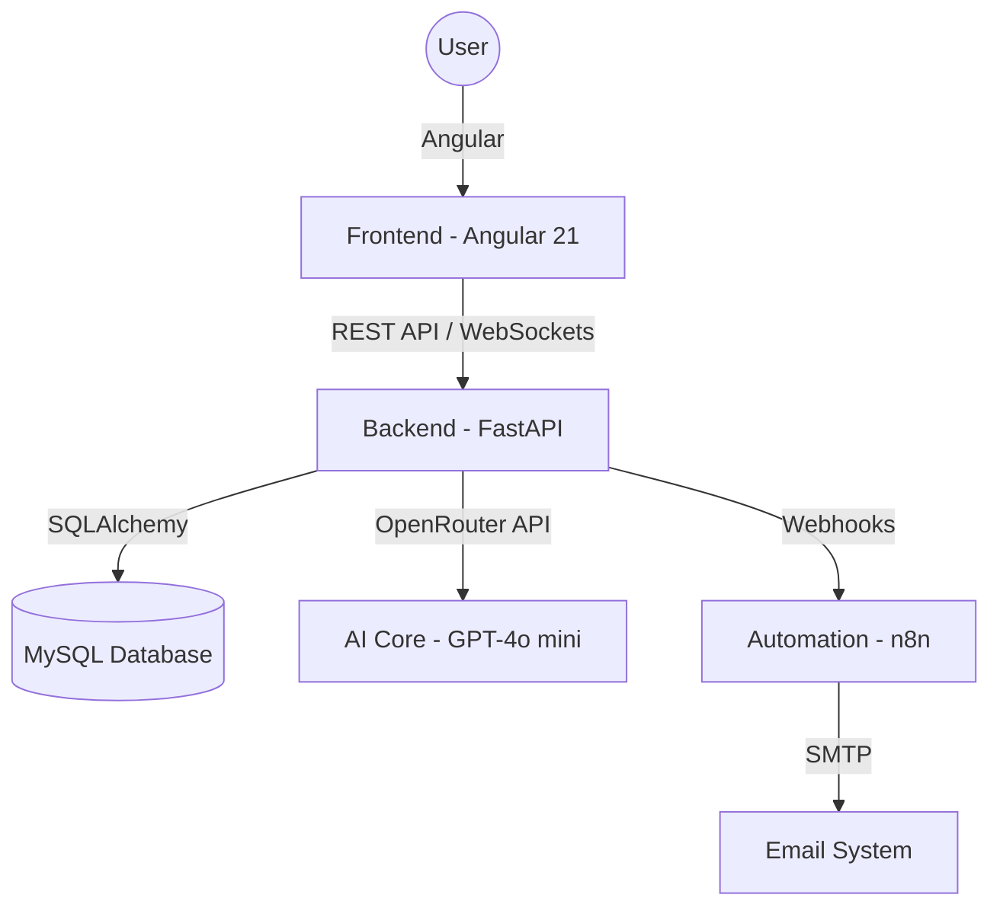

# 🚀 HireFlow Platform

[](https://fastapi.tiangolo.com/)
[](https://angular.io/)
[](https://www.mysql.com/)
[](https://openrouter.ai/)

**HireFlow** is a premium, AI-powered freelancer marketplace designed for high-performance talent matching. It combines a high-end **Angular** frontend with a robust **FastAPI** backend, featuring context-aware AI assistants, real-time communication, and automated workflows.

---

## 💎 Key Innovations

### 🤖 Context-Aware AI Ecosystem
Unlike standard chatbots, HireFlow integrates a **Role-Based AI Assistant** that dynamically queries the platform's database to provide hyper-relevant assistance:
- **Admin AI**: Full platform visibility (audits, reports, user management).
- **Client AI**: Focuses on job listings, incoming proposals, and talent filtering.
- **Freelancer AI**: Assists with job searches and proposal optimization.

### 📝 AI Bio Generation & Summarization
- **Profile Architect**: Generates professional, high-impact bios based on user achievements and skills.
- **Talent Highlights**: Automatically extracts "punchy" bullet points from long freelancer bios to help clients scan talent 5x faster.

### ⚡ Real-Time Infrastructure (WebSockets)
The platform features a persistent bi-directional communication layer:
- **Individual Streams**: Each user (Admin, Client, Freelancer) has a dedicated WebSocket connection managed by a `ConnectionManager`.
- **Instant Dispatch**: When a proposal is accepted or a job is reported, the backend instantly pushes JSON payloads to the specific user's dashboard.
- **Auto-Reconnection**: The system handles dead connections gracefully, ensuring the notification panel is always in sync.

### 🔗 Automation Logic (n8n Integration)
HireFlow offloads intensive or asynchronous tasks to an **n8n** instance, keeping the main API fast and lean:
- **Email Verification Flow**: Handles secure JWT-based email confirmation for new freelancer registrations.
- **Intelligent Alerting**: High-frequency job reports trigger an n8n webhook which can escalate alerts to Discord, Slack, or Email based on severity.
- **Workflow-as-Code**: All automation logic is version-controlled as JSON exports within the project.

---

## 🏗️ Architecture & Logic

### System Overview


### Backend Logic
The backend follows a **Service-Layer Pattern**, separating concerns into:
- **Routers**: Clean entry points for HTTP and WebSocket requests.
- **Services**: Heavy lifting (AI prompt engineering, database transactions, notification triggers).
- **Models**: Structured SQLAlchemy definitions for Users, Jobs, Proposals, Reports, and Notifications.

### Frontend Aesthetics
The frontend is built with a **Premium Design Language**:
- **Glassmorphism**: Subtle blurs, frosted glass effects, and depth-focused UI.
- **Micro-Animations**: Smooth transitions using modern CSS and Angular animations.
- **Vanilla CSS Tokens**: A custom-built design system using CSS variables for maximum performance and flexibility.

---

## 🛠️ Technology Stack

| Component | Technology | Purpose |
| :--- | :--- | :--- |
| **Frontend** | Angular 21, TypeScript | Reactive UI, SPA Architecture |
| **Backend** | Python 3.x, FastAPI | High-performance Async API |
| **Database** | MySQL | Relational data persistence |
| **ORM** | SQLAlchemy | Pythonic database interaction |
| **AI Integration** | OpenRouter (GPT-4o mini) | Bio generation, Summarization, Chatbot |
| **Automation** | n8n | Emailing, verification flows, alerts |
| **Real-time** | WebSockets | Instant notification delivery |
| **Styling** | Vanilla CSS (Custom Tokens) | Premium Glassmorphic design |

---

## 📂 Project Structure

```bash
Hireflow-project/
├── backend/                # FastAPI Application
│   ├── app/
│   │   ├── core/           # Security, WebSockets, Config
│   │   ├── models/         # Database Schema
│   │   ├── routers/        # API Endpoints
│   │   ├── services/       # Business Logic (AI, Jobs, etc.)
│   │   └── schemas/        # Pydantic Data Validation
│   └── seed_v2.py          # Database seeding script
├── frontend-clean/         # Angular Application
│   ├── src/app/
│   │   ├── pages/          # Feature components (Dashboard, Home)
│   │   ├── core/           # Interceptors, Guards
│   │   └── services/       # API Integration
├── n8n_setup_guide.md      # Documentation for automation
└── hireflow emailing system.json # n8n Workflow export
```

---

## 🚦 Getting Started

### Prerequisites
- Python 3.10+
- Node.js 18+
- MySQL Server
- OpenRouter API Key

### Installation
1. **Clone the repository:**
   ```bash
   git clone https://github.com/Saadani124/Hireflow-platform.git
   ```
2. **Setup Backend:**
   ```bash
   cd backend
   python -m venv venv
   .\venv\Scripts\activate
   pip install -r requirements.txt
   # Configure .env with DATABASE_URL and OPENROUTER_API_KEY
   python seed_v2.py
   uvicorn app.main:app --reload
   ```
3. **Setup Frontend:**
   ```bash
   cd frontend-clean
   npm install
   ng serve
   ```

---

## 📡 WebSockets Integration
The real-time architecture utilizes FastAPI's `WebSocket` capabilities to facilitate instantaneous updates without client-side polling. The `ConnectionManager` class maintains a mapping of active user IDs to their WebSocket connections, allowing the system to target specific events—such as proposal status updates or report notifications—directly to the relevant user's session in the Angular frontend.

## ⚙️ n8n Automation Engine
HireFlow leverages n8n as a specialized orchestration layer to handle long-running and external processes. By offloading task-heavy operations (like multi-channel notification routing, external API interactions for email verification, and complex report scheduling) to an external n8n workflow, the FastAPI application remains focused solely on low-latency request handling and state management.

---

## 📜 License
This project is licensed under the MIT License. Developed with ❤️ by Saadani Talel & Karnit Aziz.
