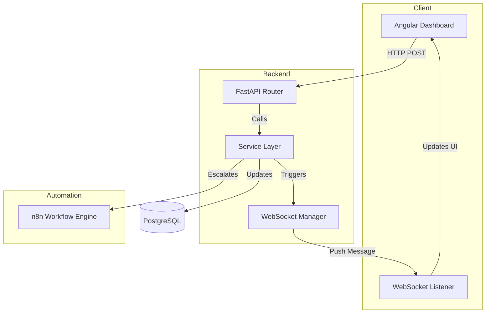

# Hireflow Platform: Technical System Architecture Whitepaper

**Prepared for:** Academic Review
**Topic:** Real-Time Systems, Moderation Workflows, and Secure Authentication

---

## 1. WebSocket & Real-Time Communication
The platform uses a persistent bi-directional communication layer to eliminate the need for inefficient HTTP polling.

### Key Files
- `backend/app/core/websocket_manager.py`: The centralized registry for active connections.
- `backend/app/routers/notification.py`: The entry point for client WebSocket handshakes.
- `frontend-clean/src/app/services/notification.ts`: The Angular client for maintaining the stream.

### Implementation Detail
The `ConnectionManager` uses a thread-safe approach to manage sessions. It maps User IDs to a list of sockets, allowing a single user to stay synchronized across multiple tabs.

```python
# backend/app/core/websocket_manager.py
class ConnectionManager:
    def __init__(self):
        # Dictionary to track {user_id: [websocket1, websocket2]}
        self.active_connections: Dict[int, List[WebSocket]] = {}

    async def connect(self, websocket: WebSocket, user_id: int):
        await websocket.accept()
        if user_id not in self.active_connections:
            self.active_connections[user_id] = []
        self.active_connections[user_id].append(websocket)

    async def send_personal_message(self, message: dict, user_id: int):
        # Directly target specific user connections
        if user_id in self.active_connections:
            for connection in self.active_connections[user_id]:
                await connection.send_json(message)
```

---

## 2. Service Layer Pattern (Architecture Optimization)
To ensure high maintainability and clean code, the platform implements a **Service Layer Pattern**. This decouples the HTTP transport logic (Routers) from the core business logic (Services).

### Key Files
- `backend/app/services/`: Contains `NotificationService`, `ReportService`, `ProposalService`, `AdminService`, and `JobService`.
- `backend/app/routers/`: Simplified controllers that call the service methods.

### Advantages
1. **DRY (Don't Repeat Yourself)**: Common logic (like sending notifications) is written once in the Service and reused across different Routers.
2. **Asynchronicity Management**: The Service Layer handles the complex `async` orchestration for WebSocket broadcasts, allowing the Routers to remain slim.
3. **Testability**: Business logic can be unit-tested independently of HTTP requests and session management.

---

## 3. Real-Time Notification System
Notifications are architected as an "Event-Driven" system. Every business action (like a job application) triggers a side-effect that broadcasts data.

### Key Files
- `backend/app/models/notification.py`: Database schema.
- `backend/app/services/notification_service.py`: Business logic for persistence and broadcasting.
- `frontend-clean/src/app/pages/home/home.ts`: UI integration with the notification stream.

### Data Flow
When a notification is created, it is both **persisted** (for history) and **broadcast** (for real-time).

```python
# backend/app/services/notification_service.py
@staticmethod
async def create_notification(db: Session, user_id: int, notif_type: str, title: str, message: str):
    # 1. Database Persistence
    notif = Notification(user_id=user_id, type=notif_type, title=title, message=message)
    db.add(notif)
    db.commit()

    # 2. WebSocket Broadcast
    notif_data = {"id": notif.id, "title": title, "message": message, "is_read": False}
    await manager.send_personal_message(notif_data, user_id)
```

---

## 4. Moderation & Reporting System
The moderation system implements a "Self-Regulating Community" model with automated escalations.

### Key Files
- `backend/app/services/report_service.py`: Logic for tracking report counts.
- `backend/app/core/n8n.py`: Integration with external automation workflows.
- `backend/app/routers/report.py`: Public API for submitting flags.

### Automatic Escalation
The system monitors report thresholds. Once a threshold is exceeded, it escalates to an external workflow (n8n) for manual review or automatic suspension.

```python
# backend/app/services/report_service.py
async def report_job(db: Session, job_id: int, user: User, reason: str):
    # ... logic to save report ...
    job.report_count += 1
    
    # Notify all admins via Real-Time WebSocket
    admins = db.query(User).filter(User.role == "admin").all()
    for admin in admins:
        await NotificationService.create_notification(db, admin.id, "report", "Job Reported", ...)

    # Escalation to external workflow (n8n) if > 2 reports
    if job.report_count > 2:
        trigger_report_alert("job", job.id, job.title, job.report_count)
```

---

## 5. Secure Email Verification System
Trust is established through a cryptographically signed email verification flow using JWT (JSON Web Tokens).

### Key Files
- `backend/app/routers/auth.py`: Registration logic and verification endpoints.
- `frontend-clean/src/app/pages/verify/verify.ts`: The landing component for email links.

### The Verification Loop
1. **Sign**: On registration, the server signs a JWT containing the `user_id` and an expiration time.
2. **Transmit**: The token is sent via n8n to the user's email.
3. **Verify**: When the user clicks the link, the server decodes the JWT. If the signature is valid and it hasn't expired, the user's status is updated.

```python
# backend/app/routers/auth.py (Token Creation)
def create_verification_token(user_id: int) -> str:
    payload = {
        "user_id": user_id,
        "purpose": "email_verification",
        "exp": datetime.utcnow() + timedelta(hours=24) # 24h Security Window
    }
    return jwt.encode(payload, SECRET_KEY, algorithm=ALGORITHM)
```

---

## Technical Architecture Overview


